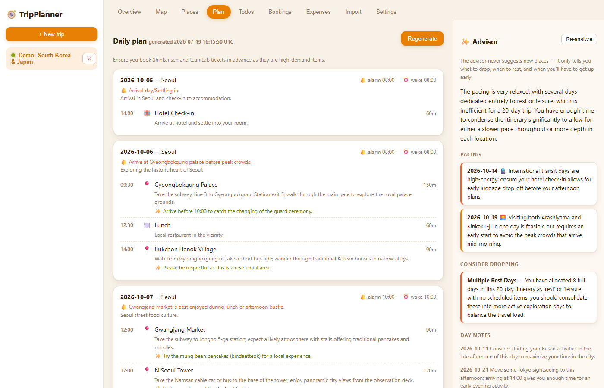
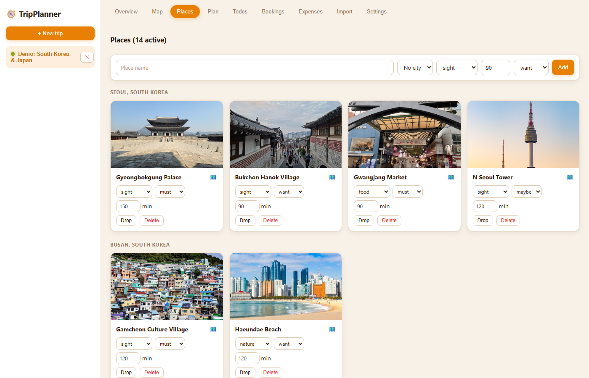
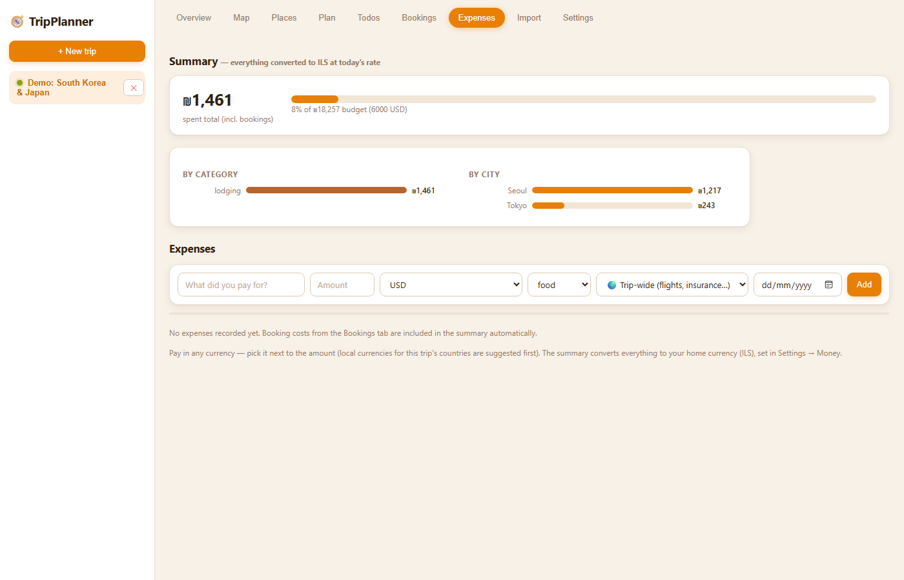
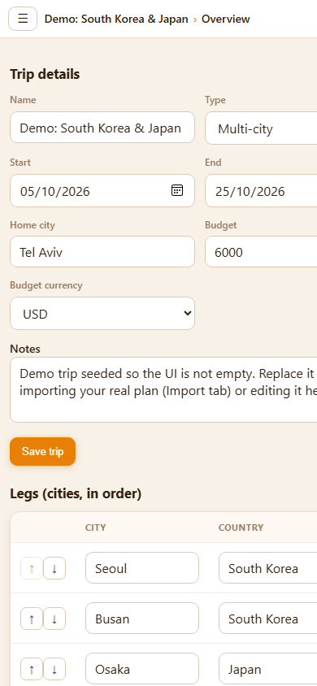

# 🧭 TripPlanner

Self-hosted travel planner that turns **your** chosen places into a realistic day-by-day
schedule — and, unlike every other travel site, **never suggests new places**. Instead it
tells you what to *drop*, when to *rest*, and when you'll have to *wake up early* to make
your own plan work.



## TL;DR — run it in 2 minutes

```bash
mkdir tripplanner && cd tripplanner

# docker-compose.yml
cat > docker-compose.yml <<'EOF'
services:
  tripplanner:
    image: ghcr.io/saarcohenn/tripplanner:latest
    container_name: tripplanner
    ports:
      - "8080:8080"
    environment:
      - GOOGLE_MAPS_API_KEY=${GOOGLE_MAPS_API_KEY:-}
    volumes:
      - tripplanner-data:/app/data
    restart: unless-stopped
volumes:
  tripplanner-data:
EOF

# .env — optional but recommended (Google map tiles, English labels, place photos)
echo "GOOGLE_MAPS_API_KEY=your-browser-key-here" > .env

docker compose up -d
# open http://localhost:8080 → Settings → paste your LLM API key
```

That's it. Everything (trips, settings, your API keys) lives in the `tripplanner-data`
volume; the `.env` file stays on your machine and is never baked into the image.

## What it does

| | |
|---|---|
| **Plan, not suggestions** | Your configured LLM arranges *only the places you added* into a detailed daily guide: directions between stops, queue-avoidance tips, meals, transit, rest blocks, and a per-day **alarm suggestion** ("Alarm 06:45 — be at Fushimi Inari by 07:30, before the tour groups"). |
| **Advisor** | Reviews the plan and flags overloaded days, drop candidates, needed rest and early wake-ups. Hard-prompted to never recommend new attractions. |
| **Multi-city trips** | A trip is an ordered list of legs (city + date range). One-way, round-trip and multi-city all work. |
| **Money** | Log expenses in any currency (trip-local currencies suggested first), booking costs included automatically, everything converted to **your home currency** at daily rates and tracked against the trip budget. |
| **Import** | Paste a planning conversation (Claude / ChatGPT / any language, Hebrew included) and the LLM extracts destinations, dates, places, budget and todos into a new trip. Nothing is invented. |
| **BYO LLM** | Anthropic, OpenAI, Google Gemini or OpenRouter. Keys are stored only in the app's SQLite DB on your server and used server-side. |

### Places with photos, map, bookings

Places are collected from an interactive map (Google Maps with English labels + place
photos when a key is set; Leaflet/OpenStreetMap otherwise). Bookings get one-click
Booking.com / Airbnb searches pre-filled with each city and your dates.



### Expense tracking in your home currency



### Mobile-first PWA

Installable on iOS/Android (Add to Home Screen). Drawer navigation with a
`trip › page` breadcrumb top bar.



### Plan lifecycle

1. **Collect** — add legs, then places (map pin, search, or import). Trip dot is grey.
2. **Plan** — one click generates the daily guide + advisor review. Trip dot turns **green**.
3. **Guard** — adding a place to a planned trip asks for confirmation first; any change
   marks the plan outdated, and with *Auto-replan* on it regenerates itself seconds later.

## First-time setup

1. Open **Settings** → pick your LLM provider, paste the API key, **Save**, then **Test**.
   Use **Load model list** to pick a model from the provider's live catalog.
2. Set your **home currency** (Settings → Money) — all spending is converted to it.
3. Optionally add a Google Maps key (env var or Settings) for Google tiles + photos.
4. Create a trip (or **Import** one from a planning conversation), add legs in
   **Overview**, add places from the **Map**/**Places** tab, then **Plan → Generate**.

## Deployment

### Image

Every push to `main` builds and pushes `ghcr.io/saarcohenn/tripplanner:latest`
(multi-stage build, Node 24 slim) via [`docker.yml`](.github/workflows/docker.yml).
Tagged releases (`v*`) get version tags.

### Auto-deploy to a homelab server

GitHub's hosted runners can't reach a LAN server, so deployment uses a
**self-hosted runner** on the box itself: [`deploy.yml`](.github/workflows/deploy.yml)
waits for the image build to succeed, then runs `docker compose pull tripplanner && up -d
tripplanner` against wherever the `tripplanner` service is defined — on this deployment
that's a service inside a shared `docker-compose.yml` alongside other homelab containers,
not its own directory (see [`deploy/docker-compose.server.yml`](deploy/docker-compose.server.yml)
for the standalone version if you're starting fresh).

One-time server setup:

```bash
# on the server
mkdir -p ~/docker/tripplanner   # or add the tripplanner service to an existing compose file
# install a runner: GitHub repo → Settings → Actions → Runners → New self-hosted runner
# (run it as a service: ./svc.sh install && ./svc.sh start)
```

If you'd rather not run a runner, `docker compose pull && docker compose up -d` via
ssh/cron or [Watchtower](https://containrrr.dev/watchtower/) works just as well.

## Local development

```bash
# terminal 1 — API on :8090 (so it can run next to the production container on :8080)
cd backend && npm install && npm run dev

# terminal 2 — Vite dev server on :5173 (proxies /api)
cd frontend && npm install && npm run dev
```

## Architecture

```
frontend/   React + TypeScript + Vite + Leaflet (react-leaflet) + @vis.gl/react-google-maps
backend/    Node 24 + Express + better-sqlite3 (single-file DB in ./data or $DATA_DIR)
Dockerfile  multi-stage: builds frontend, compiles backend, single runtime image on :8080
```

The backend proxies all LLM calls server-side (`/api/trips/:id/generate-plan`,
`/api/trips/:id/advise`, `/api/import/conversation`), so API keys never reach the
browser — `GET /api/settings` returns only a masked fingerprint. FX rates come from a
free daily-rates API, cached server-side for 12 h.
