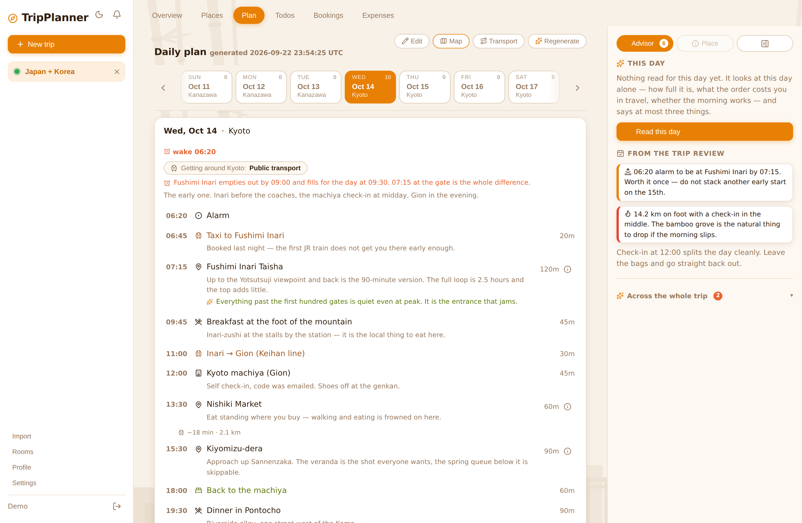
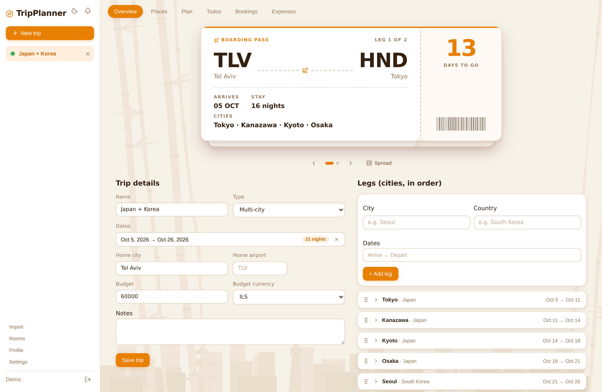
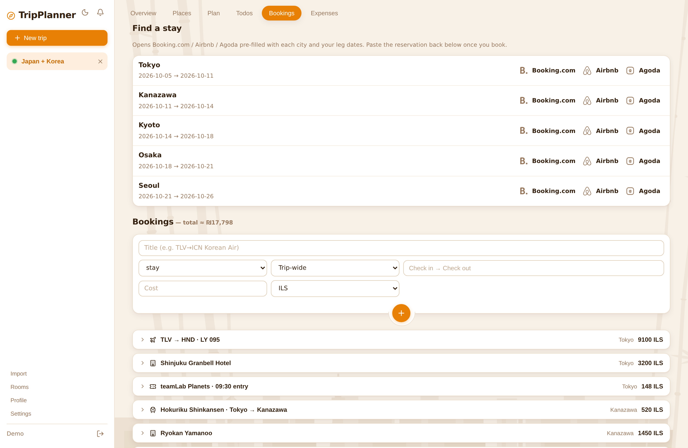
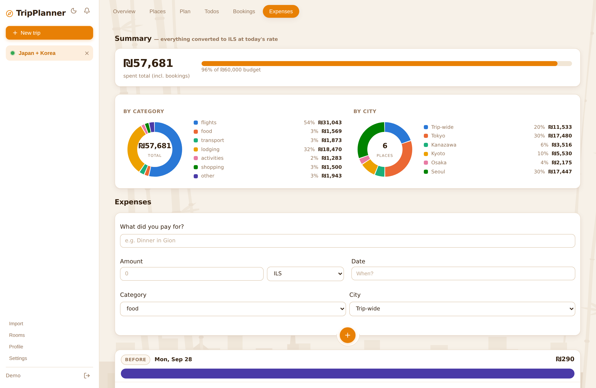
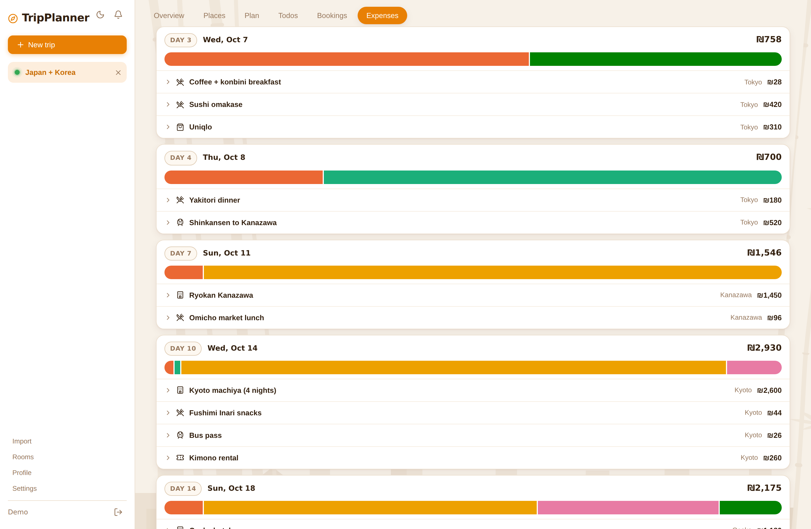
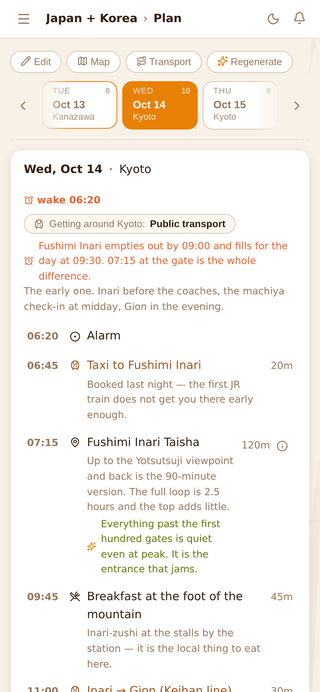
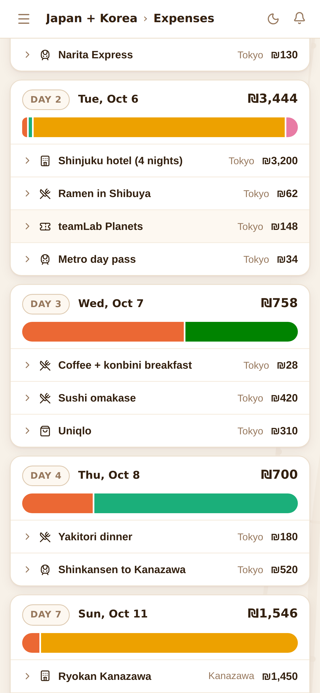

# 🧭 TripPlanner

Self-hosted travel planner that turns **your** chosen places into a realistic day-by-day
schedule — and, unlike every other travel site, **never suggests new places**. Instead it
tells you what to *drop*, when to *rest*, and when you'll have to *wake up early* to make
your own plan work.



<sub>Screenshots are of a seeded demo trip.</sub>

## TL;DR — run it in 2 minutes

```bash
mkdir tripplanner && cd tripplanner

# docker-compose.yml
cat > docker-compose.yml <<'EOF'
services:
  tripplanner:
    image: ghcr.io/saarcohenn/tripplanner:latest
    container_name: tripplanner
    ports:
      - "8080:8080"
    environment:
      - GOOGLE_MAPS_API_KEY=${GOOGLE_MAPS_API_KEY:-}
    volumes:
      - tripplanner-data:/app/data
    restart: unless-stopped
volumes:
  tripplanner-data:
EOF

# .env — optional but recommended (Google map tiles, English labels, place photos)
echo "GOOGLE_MAPS_API_KEY=your-browser-key-here" > .env

docker compose up -d
# open http://localhost:8080 — first visit prompts you to create the admin account,
# then add your LLM key under Profile
```

That's it. Everything (trips, accounts, your API keys) lives in the `tripplanner-data`
volume; the `.env` file stays on your machine and is never baked into the image.

## What it does

| | |
|---|---|
| **Plan, not suggestions** | Your configured LLM arranges *only the places you added* into a detailed daily guide: directions between stops, queue-avoidance tips, meals, transit, rest blocks, and a per-day **alarm suggestion** ("Alarm 06:20 — be at Fushimi Inari by 07:15, before the coaches"). |
| **A review of the day you're looking at** | Each day gets its own read — how full it is, what the order costs you in travel, whether the morning works — capped at three points, and cached against a fingerprint of the day so it can tell you when it's describing a day you've since changed. The trip-wide review sits underneath it, folded away. |
| **Build it by hand too** | The plan isn't take-it-or-leave-it: edit mode lets you drag places onto a day, reorder stops, retime the day around them, move a day to another date, and add days the generator never made. Hand-built plans get reviewed the same way. |
| **A chat per day** | Ask for a change to one day and it proposes a rewrite you accept or discard. It cannot invent a place: if it needs somewhere new it may only reply with search queries, which the server runs against Google Places — the model picks the search, Google picks the places, and the server rebuilds every field from its own record. |
| **Multi-city trips** | A trip is an ordered list of legs (city + date range). One-way, round-trip and multi-city all work, and each leg carries how you get around that city. |
| **Money** | Log expenses in any currency (trip-local ones suggested first), booking costs included automatically, everything converted to **your home currency** and tracked against the budget — with the list grouped into one card per day. |
| **Import** | Paste a planning conversation (Claude / ChatGPT / any language, Hebrew included) and the LLM extracts destinations, dates, places, budget and todos. Paste a Google Maps list link and the places come in with your own notes attached. Nothing is invented. |
| **BYO LLM** | Anthropic, OpenAI, Google Gemini or OpenRouter. Keys are per-user, stored only in the app's SQLite DB on your server, and used server-side. Profile tracks token spend against a monthly budget you set. |
| **Multi-user & rooms** | The first account created becomes the admin; anyone else can sign up but needs admin approval. Each user brings their own LLM key/budget/prompt. **Rooms** hold one or more trips shared with the people you invite — invite someone to a room and they get access to everything in it. |

### The day

The day strip pins to the top as you scroll, the map draws the day's stops in order, and
every stop carries what the model actually knows about it — how long to give it, what to
skip, which entrance. The alarm line is the one the advisor argues for; the transport chip
states the assumption the timings rest on, because an estimate you can't see the
assumption behind is worthless.

### Trip at a glance



Legs are drag-to-reorder, and the boarding pass counts down to the first flight.

### Places with photos, map, bookings

Places are collected from an interactive map (Google Maps with English labels + place
photos when a key is set; Leaflet/OpenStreetMap otherwise), from a text search, or from a
Google Maps list you already made. Each place carries its city, category, priority, how
long you want there, and a note — yours or the one that came with the list, marked for
which.

Place photos are downloaded from Google once and cached to disk (inside the same data
volume as the database) — repeat views are served locally instead of re-billing the
Places Photo API.

Bookings get one-click Google Flights / Skyscanner / Expedia and Booking.com / Airbnb /
Agoda searches, pre-filled with each city and your leg dates.



### Expense tracking in your home currency



Every expense is converted at the day's rate, split by category and by city, and counted
against the budget. The list underneath is one card per day of the trip — the day's
number, its date, what it came to, and a bar of where the money went:



### Mobile-first PWA

Installable on iOS/Android (Add to Home Screen). Drawer navigation with a
`trip › page` breadcrumb top bar, and tabs that size themselves against the column they
actually have rather than the window — the day and the expense cards hold down to 320px.

<p>
  
  
</p>

### Plan lifecycle

1. **Collect** — add legs, then places (map pin, search, or import). Trip dot is grey.
2. **Plan** — one click generates the daily guide + advisor review. Trip dot turns **green**.
3. **Guard** — adding a place to a planned trip asks for confirmation first; any change
   marks the plan outdated, and with *Auto-replan* on it regenerates itself seconds later.

## First-time setup

1. **First visit ever**: you'll be asked to create the admin account (email + password).
   That's the only account that exists until you approve others.
2. Open **Profile** → pick your LLM provider, paste the API key, **Save**, then **Test**.
   Use **Load model list** to pick a model from the provider's live catalog. Set your
   **home currency** here too — all spending is converted to it.
3. Optionally add a Google Maps key (env var or **Settings**, admin-only) for Google
   tiles + photos — this is shared across every user on the server.
4. Create a trip (or **Import** one from a planning conversation), add legs in
   **Overview**, add places from the **Places** tab, then **Plan → Generate**.
5. Sharing a trip with someone else? Open **Rooms**, create a room (or use your default
   personal one), invite them by email, and create/move trips into it — every member of
   a room can see and edit every trip inside it, using their own LLM key.

### Adding more people

Anyone can sign up, but new accounts sit in **pending** until an admin approves them
from **Settings → Users**. From there you can also promote/demote admins or disable an
account. There's no invite-by-admin flow — people create their own account and wait for
approval.

## Deployment

### Image

Every push to `main` builds and pushes `ghcr.io/saarcohenn/tripplanner:latest`
(multi-stage build, Node 24 slim) via [`docker.yml`](.github/workflows/docker.yml).
Tagged releases (`v*`) get version tags.

### Auto-deploy to a homelab server

GitHub's hosted runners can't reach a LAN server, so deployment uses a
**self-hosted runner** on the box itself: [`deploy.yml`](.github/workflows/deploy.yml)
waits for the image build to succeed, then runs `docker compose pull tripplanner && up -d
tripplanner` against wherever the `tripplanner` service is defined — on this deployment
that's a service inside a shared `docker-compose.yml` alongside other homelab containers,
not its own directory (see [`deploy/docker-compose.server.yml`](deploy/docker-compose.server.yml)
for the standalone version if you're starting fresh).

One-time server setup:

```bash
# on the server
mkdir -p ~/docker/tripplanner   # or add the tripplanner service to an existing compose file
# install a runner: GitHub repo → Settings → Actions → Runners → New self-hosted runner
# (run it as a service: ./svc.sh install && ./svc.sh start)
```

The deploy job is pinned to that runner, so with the box offline it queues rather than
failing. `docker compose pull tripplanner && docker compose up -d tripplanner` on the
server does the same thing by hand, and
[Watchtower](https://containrrr.dev/watchtower/) or ssh/cron works just as well.

## Local development

```bash
# terminal 1 — API on :8090 (so it can run next to the production container on :8080)
cd backend && npm install && npm run dev

# terminal 2 — Vite dev server on :5173 (proxies /api)
cd frontend && npm install && npm run dev
```

## Architecture

```
frontend/   React + TypeScript + Vite + Leaflet (react-leaflet) + @vis.gl/react-google-maps
backend/    Node 24 + Express + better-sqlite3 (single-file DB in ./data or $DATA_DIR)
Dockerfile  multi-stage: builds frontend, compiles backend, single runtime image on :8080
```

The backend proxies all LLM calls server-side (`/api/trips/:id/generate-plan`,
`/api/trips/:id/advise`, `/api/trips/:id/plan/day-advice`, `/api/trips/:id/plan/chat`,
`/api/import/conversation`), so API keys never reach the browser — `GET /api/auth/me`
returns only a masked fingerprint of your key. Plan generation runs as a detached job and
streams its result back over SSE, so a slow model can't time out the browser's request.
Sessions are plain server-side tokens in an httpOnly cookie (no JWT, no third-party auth).
FX rates come from a free daily-rates API, cached server-side for 12 h.
